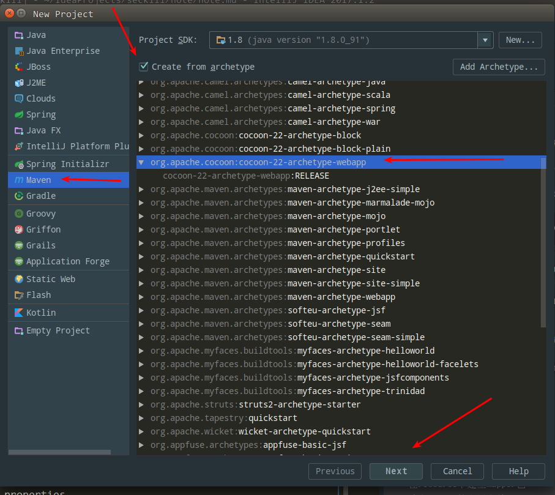
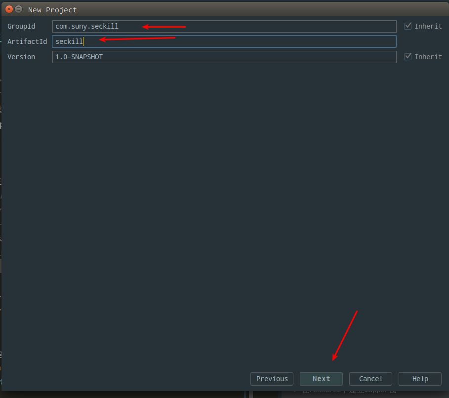
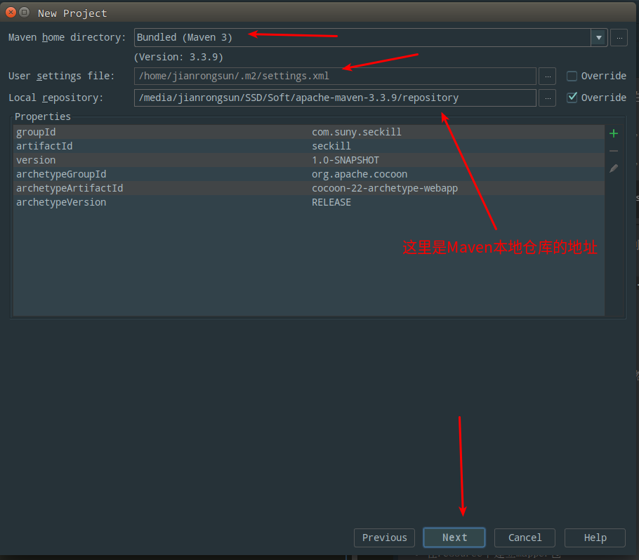
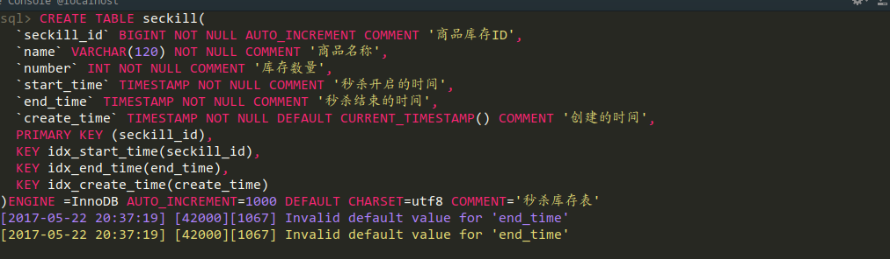
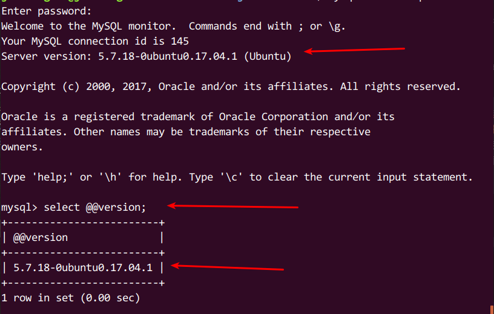

# SSM实战项目-Java高并发秒杀API
基于 SpringMVC + Spring + MyBatis 框架模拟高并发商品秒杀项目,学习目前较流行的Java框架组合实现高并发秒杀API

本文包括了项目的完整流程+开发过程中遇到的各种坑的总结+学习笔记和问题扩展
## 项目介绍
>何为秒杀？

所谓“秒杀”，就是网络卖家发布一些超低价格的商品，所有买家在同一时间网上抢购的一种销售方式。由于商品价格低廉，往往一上架就被抢购一空，有时只用一秒钟。

>为何选择Java高并发秒杀作为实战项目？

* 秒杀业务场景具有典型事务特性
* 秒杀/红包类需求越来越常见

>为何使用SpringMVC+Spring+MyBatis框架

* 框架易于使用和轻量级
* 低代码侵入性
* 成熟的社区和用户群

>能从该项目得到什么收获？

* 框架的使用和整合技巧
* 秒杀分析过程与优化思路

## 项目中用到的技术

>MySQL

* 表设计
* SQL技巧
* 事务和行级锁

>MyBatis

* DAO层设计与开发
* MyBatis合理使用
* 与Spring整合

>Spring

* Spring 整合MyBatis
* 声明式事务运用

>SpringMVC

* Restful借口设计和使用
* 框架运作流程
* Controller开发技巧

>前端

* 交互设计
* Bootstrap
* jQuery
* Ajax

>高并发

* 高并发点和高并发分析
* 优化思路并实现

## 开发环境

* **操作系统**：Windows 7
* **IDE** ：IntelliJ IDEA 2017.3.4 x64 用Eclipse也一样的,工具时靠人用的
* **JDK** : JDK1.8 建议使用JDK1.7以上版本,有许多语法糖用着挺舒服的
* **中间件**：Tomcat 8.5
* **数据库** ：Mysql-5.7-WinX64 实验性的项目用Mysql就足够啦
* **框架**：SpringMVC + Spring + MyBatis
* **构建工具** : Maven  管理jar包真的很方便  

  这里列出的环境不是必须的,你喜欢用什么就用什么,这里只是给出参考,不过不同的版本可能会引起各种不同的问题就需要我们自己去发现以及排查,在这里使用Maven的话时方便我们管理JAR包,我们不用跑去各种开源框架的官网去下载一个又一个的JAR包,配置好了Maven后添加pom文件坐标就会从中央仓库下载JAR包,如果哪天替换版本也很方便

## 项目总结

项目总结可能比较的长,**密集恐惧症**者请按小节进行阅读  

- [(一)Java高并发秒杀API之业务分析与DAO层](/note/note1.md)
- [(二)Java高并发秒杀API之Service层](/note/note2.md)
- [(三)Java高并发秒杀API之web层](/note/note3.md)
- [(四)Java高并发秒杀API之高并发优化](/note/note4.md) 

其实这几个流程也就是开发的流程,首先从DAO层开始开发,从后往前开发,开始Coding吧！
## 项目源码

* [**GitHub地址**](https://github.com/albertrui/Seckill)

---
>>>>>>>>>>>>>>>>>>>>>>>>>>>>>>>>>>>>>>>>>>>>---
---
## 项目效果图
 - 秒杀商品列表  
 
  

 - 秒杀结束提示界面  
 
  

 - 开始秒杀提示界面  
 
 
 
 - 重复秒杀提示界面  
 
  

 - 秒杀秒杀成功提示界面  
 
  

---
## 项目的运行
### 下载  

`Download Zip`或者 `git clone`
``` shell
git clone https://github.com/albertrui/seckill.git
```
### 导入到IDE  
这里因为是使用`IDEA`创建的项目,所以使用`IDEA`直接打开是很方便的,提前是你要配置好`maven`的相关配置,以及项目`JDK`版本,
`JDK`版本必须在`1.8`以上,因为在项目中使用了`Java8`的`LocalDateTime`以及`LocalDate`,所以低于这个版本编译会失败的
  - IDEA  
  直接在主界面选择`Open`,然后找到项目所在路径,点击导入就可以了
  - Eclipse    
  这个项目是基于`IDEA`创建,可以把把项目转成`Eclipse`的项目,如果你使用Eclipse的话也可以直接导入,只是步骤更繁琐一点,[Eclipse导入步骤](/note/EclipseImport.md)
  
---
>>>>>>>>>>>>>>>>>>>>>>>>>>>>>>>>>>>>>>>>>>>>---

# (一)Java高并发秒杀API之业务分析与DAO层设计
## 1. 创建Maven项目和依赖
### 1.1 创建项目前需要先安装Maven，并设置好环境变量

* [Maven下载](http://download.csdn.net/download/lewky_liu/10000144)
* 设置环境变量
	* 新建变量`MAVEN_HOME`，值为Maven的目录`X:\XXX\apache-maven-XXX`
	* 将`%MAVEN_HOME%\bin`添加到`Path`变量下
* 运行CMD，输入`mvn -v`后可以看到Maven的版本信息等则表示安装成功
### 1.2 创建Maven项目有两种方式，如下

**第一种创建方式：使用命令行手动创建**

	mvn archetype:generate -DgroupId=org.seckill -DartifactId=seckill -Dpackage=org.seckill -Dversion=1.0-SNAPSHOT -DarchetypeArtifactId=maven-archetype-webapp

在视频中使用的是`archetype:create`，该方法已被废弃，请使用`archetype:generate`来创建。命令行执行后会创建一个`maven-archetype-webapp`骨架的Maven项目，其中`groupId`是项目组织唯一的标识符，实际对应JAVA的包的结构；`artifactId`是项目的唯一的标识符，实际对应项目的名称；`package`一般是`groupId`+`artifactId`，是自动生成的，可以修改

**第二种创建方式：借助IDE工具的Maven插件来创建项目(这里使用idea)**
  + 点击左上角`File>New>Project>Maven`
  + 然后在里面勾选`Create from archetype`,然后再往下拉找到`org.apache.cocoon:cocoon-22-archetype-webapp`,选中它,注意要先勾选那个选项,否则选择不了,然后点击`Next`继续  
      
  +然后就填写你的Maven的那几个重要的坐标了,自己看着填吧  
    
  +再就配置你的Maven的相关信息,默认应该是配置好的  
    
  +之后就是点`Finsh`,到此不出意外的话就应该创建成功了
  ####  这里我们需要修改下`web.xml`中的servlet版本为`3.0`
  打开`WEB-INF`下的`web.xml`,修改为以下代码:
  ```xml
  <web-app xmlns="http://java.sun.com/xml/ns/javaee"
           xmlns:xsi="http://www.w3.org/2001/XMLSchema-instance"
           xsi:schemaLocation="http://java.sun.com/xml/ns/javaee
                        http://java.sun.com/xml/ns/javaee/web-app_3_0.xsd"
           version="3.0"
           metadata-complete="true">
      <!--用maven创建的web-app需要修改servlet的版本为3.0-->
  ```
  修改的原因有以下几点:  
     * 高版本的Servlet支持更多的特性,更方便我们的Coding,特别是支持注解这一特性
     * 在`Servlet2.3`中新加入了`Listener`接口的实现,,我们可以使用`Listener`引入`Spring`的`ContextLoaderListener`  
  
  举个栗子:  
    + 在`Servlet2.3`以前我们这样配置`ContextLoaderListener`:
  ```xml
  <servlet>
   <servlet-name>context</servlet-name>
   <servlet-class>org.springframework.context.ContextLoaderServlet</servlet-class>
   <load-on-startup>1</load-on-startup>
  </servlet>
  ```
   + 在`Servlet2.3`以后可以使用`Listener`配置,也就是我们项目中使用的方法
   ````xml
  <listener>
   <listener-class>org.springframework.context.ContextLoaderListener</listener-class>
  </listener>
  ````
  两种方法的效果都是一样的,主要不要同时使用,否则会报错的      
  
### 1.3 修改pom.xml文件

当创建完Maven项目后会在根目录下有一个pom.xml文件，Maven项目通过pom.xml进行项目依赖的管理

项目基本的骨架我们就创建出来了,接下来我们要添加一些基本的JAR包的依赖,也就是在[pom.xml](/pom.xml)中添加各种开源组件的三坐标了
>关于maven依赖的简化写法

pom.xml文件中有一些依赖是可以省略不写的，因为有些包会自动依赖其它的包（Maven的传递性依赖）。这里面可以省略的依赖有：spring-core;spring-beans（上面这两个spring-context会自动依赖）;spring-context，spring-jdbc（mybatis-spring会依赖）；spring-web（spring-webmvc会依赖）；logback-core（logback-classic会依赖）

>有想要了解Maven的依赖范围与传递性依赖的请参考[该博文](http://blog.csdn.net/lewky_liu/article/details/78145211)
## 2. 秒杀业务分析

### 2.1 业务分析

>秒杀业务的核心是对库存的处理，其业务流程如下图

 

> 用户针对库存业务分析

当用户执行秒杀成功时，应该发生以下两个操作：

* 减库存
* 记录购买明细

这两个操作属于一个完整事务，通过事务来实现数据落地
>为什么需要事务？

* 减库存却没有记录购买明细，会导致商品少卖
* 记录购买明细却没有减库存，会导致商品超卖

在实际中，以上都是很严重的事故，会给商家或买家带来损失，这是不能被允许的。一旦发生这种事故，事故责任很自然的就会去找设计实现业务的程序员

>如何实现数据落地？

有**MySQL与NoSQL**两种数据落地的方案

* MySQL属于关系型数据库，而MySQL内置的事务机制来可以准确的帮我们完成减库存和记录购买明细的过程。MySQL有多种存储引擎，但只有InnoDB存储引擎支持事务。InnoDB支持行级锁和表级锁，默认使用行级锁
* NoSQL属于非关系型数据库，近些年来在数据存储方面承担了很大的职责，但是对于事务的支持做的并不是很好，更多追求的是性能、高复用、分布式。

事务机制依然是目前最可靠的数据落地方案。

> 数据落地与不数据落地

* **落地数据**：就是被持久化的数据，这种数据一般放在硬盘或是其他的持久化存储设备里，例如：图片、系统日志、在页面上显示的数据以及保存在关系数据库里的数据等等，落地数据一定会有一个固定的载体，他们不会瞬时消失的。
* **不落地数据**：一般指存储在内存或者是网络传输里的数据，这些数据是瞬时，使用完毕就会消失，例如：我们在浏览器发送给服务器的请求；从数据库读取出来的一直到页面展示前的数据等等。
* “不落地”传输能够满足用户在性能上的要求。

### 2.2 使用MySQL实现秒杀的难点分析

>难点问题：如何高效地处理竞争？

当一个用户在执行秒杀某件商品时，其他也想要秒杀该商品的用户就只能等待，直到上一个用户提交或回滚了事务，他才能够得到该商品的锁执行秒杀操作。这里就涉及到了锁的竞争。

 

对于MySQL来说，竞争反应到背后的技术是就是事务+行级锁：

start transaction（开启事务）→ update库存数量 → insert购买明细 → commit（提交事务）

在秒杀系统中，在同一时刻会有很多用户在秒杀同一件商品，那么如何高效低处理这些竞争？如何高效地提交事务？这些将在[Java高并发秒杀API(四)之高并发优化](http://blog.csdn.net/lewky_liu/article/details/78166080)进行分析总结。

>实现哪些秒杀功能？

下面先以天猫的秒杀库存系统为例，如下图

 

可以看到，天猫的秒杀库存系统是很复杂的，需要很多工程师共同开发。在这里，我们只实现秒杀相关的功能

* 秒杀接口暴露
* 执行秒杀
* 相关查询

>为什么要进行秒杀接口暴露的操作？

现实中有的用户回通过浏览器插件提前知道秒杀接口，填入参数和地址来实现自动秒杀，这对于其他用户来说是不公平的，我们也不希望看到这种情况

## 3. DAO层设计
### 3.1 建立数据库
在根目录下有一个[sql](/src/main/sql)文件夹里面存放我们本项目的sql数据库脚本,如果你不想自己手写的话就直接导入到你的数据库里面去吧,不过还是建议自己手写一遍加深印象

>秒杀成功明细表为何使用联合主键

之所以使用联合主键，是为了能够过滤重复插入，可以通过`insert ignore into`语句来避免用户重复秒杀同一件商品。这样当有重复记录就会忽略，语句执行后返回数字0。
	
>可能存在的问题

+ 我们的建表过程，可能会出现建表失败的情况。原因是当你给一个timestamp设置为on update current_timestamp的时候，其他的timestamp字段需要显式设定default值。但是如果你有两个timestamp字段，但是只把第一个设定为current_timestamp而第二个没有设定默认值，MySQL也能成功建表,但是反过来就不行。这是mysql5.5版本对timestamp的处理。为了解决这个问题，将create_time放到start_time和end_time的前面，还有的mysql版本需要将三个时间戳都设置默认值。
+ 在建立数据库时,如果按照我这里的数据库脚本建立的话应该是没问题的,但是我按照视频里面的数据库脚本建表的话发生了一个错误  
  
 这个报错看起来比较的诡异,我仔细检查`sql`也没有错误,它总提示我`end_time`要有一个默认的值,可我记得我以前就不会这样,然后视频里面也没有执行错误,然后我感觉可能时`MySQL`版本的差异,我查看了下我数据库版本,在登录`Mysql`控制台后输入指令,在控制台的我暂时知道的有两种方式:
 ```sql
select version();  
select @@version;
```
我的输出结果如下:

其实登录进控制台就已经可以看到版本了,我的Mysql是`5.7`的,以前我用的时`5.6`的,然后去`Google`上搜索了下,找到了几个答案,参考链接：  
  - [Invalid default value for 'create_date' timestamp field
](https://stackoverflow.com/questions/9192027/invalid-default-value-for-create-date-timestamp-field)  
 - [mysql官方的解释](https://dev.mysql.com/doc/refman/5.7/en/sql-mode.html#sqlmode_no_zero_date)  
 - [MySQL Community 5.7 - Invalid default value (datetime field type)
](https://stackoverflow.com/questions/34570611/mysql-community-5-7-invalid-default-value-datetime-field-type)  
总结出来一句话就是:
> mysql 5.7中,默认使用的是严格模式,这里的日期必须要有时间,所以一定要给出默认值,要么就修改数据库设置  

然后网友评论里总结出来的几种解决办法,未经测试！：  
 + 下次有问题一定要先看一下评论！！！create不了的同学,可以这样写：
 ```sql
    `start_time` TIMESTAMP NOT NULL DEFAULT CURRENT_TIMESTAMP COMMENT '秒杀开始时间',
    `end_time` TIMESTAMP NOT NULL DEFAULT CURRENT_TIMESTAMP COMMENT '秒杀结束时间',
    `create_time` TIMESTAMP NOT NULL DEFAULT CURRENT_TIMESTAMP COMMENT '创建时间',
 ```
    
+ 关于timestamp的问题,需要先运行 set explicit_defaults_for_timestamp = 1,否则会报invalid default value错误
+ 还需要注意的是SQL版本的问题会导致视频中seckill表创建会出错。只要将create_time放在start_time和end_time之前是方便的解决方法。  

 对比下我修改过后的跟视频里面的`sql`片段:
   
 我们可以看到在这三个字段有一个小差别,那就是给`start_time`,`end_time`,`create_time`三个字段都添加一个默认值,然后执行数据库语句就没问题了
 
 ### 3.2 创建数据表对应的实体类
 
 >在`src/main/java`包下创建org.seckill.entity包，接着建立[Seckill.java](/src/main/java/org/seckill/entity/Seckill.java)实体类
 
 >在`org.seckill.entity`包下，接着建立[SuccessKilled.java](/src/main/java/org/seckill/entity/SuccessKilled.java)实体类
 
 ### 3.3 创建实体类对应的DAO层接口（也就是Mapper接口，DAO针对的是具体实体来操作的“实体的增删改查”）
 
 >在`src/main/java`下建立`org.seckill.dao`包，在包下建立[SeckillDao.java](/src/main/java/org/seckill/dao/SeckillDao.java)接口
 
 >在`org.seckill.dao`包下建立[SuccessKilledDao.java](/src/main/java/org/seckill/dao/SuccessKilledDao.java)接口
 
 >为什么有的方法形参前有@Param，有的却没有？
 
 从上面的代码可以发现，当方法的形参在两个及两个以上时，需要在参数前加上@Param，如果不加上该注解会在之后的测试运行时报错。这是Sun提供的默认编译器（javac）在编译后的Class文件中会丢失参数的实际名称，方法中的形参会变成无意义的arg0、arg1等，在只有一个参数时就无所谓，但当参数在两个和两个以上时，传入方法的参数就会找不到对应的形参。因为Java形参的问题，所以在多个基本类型参数时需要用@Param注解区分开来。
 
 ### 3.4 基于MyBatis实现DAO接口
 
 >MyBatis怎么用？SQL写在哪里？
 
 Mybatis有两种提供SQL的方式：XML提供SQL、注解提供SQL（注解是java5.0之后提供的一个新特性）。
 
 对于实际的使用中建议使用XML文件的方式提供SQL。如果通过注解的方式提供SQL，由于注解本身还是java源码，这对于修改和调整SQL其实是非常不方便的，一样需要重新编译类，当我们写复杂的SQL尤其拼接逻辑时，注解处理起来就会非常繁琐。而XML提供了很多的SQL拼接和处理逻辑的标签，可以非常方便的帮我们去做封装。 
 
 >如何去实现DAO接口？
 
 Mapper自动实现DAO（也就是DAO只需要设计接口，不需要去写实现类，MyBatis知道我们的参数、返回类型是什么，同时也有SQL文件，它可以自动帮我们生成接口的实现类来帮我们执行参数的封装，执行SQL，把我们的返回结果集封装成我们想要的类型） 。
 
 第二种是通过API编程方式实现DAO接口（MyBatis通过给我们提供了非常多的API，跟其他的ORM和JDBC很像）
 
 在实际开发中建议使用Mapper自动实现DAO，这样可以直接只关注SQL如何编写，如何去设计DAO接口，帮我们节省了很多的维护程序，所有的实现都是MyBatis自动完成。
 
 >创建一个目录存放Mybatis的SQL映射
 
 按照Maven的规范，SQL映射文件应该放在`src/main/resources`包下，在该包下建立`mapper`目录，用来存放映射DAO接口的XML文件。这样Maven在编译时就会自动将`src/main/resources`下的这些配置文件编译进来。
 
 我们也可以按照原本的习惯，在`src/main/java`下建立`org.seckill.mapper`包，将这些SQL映射存放到这里。由于Maven默认不会编译`src/main/java`下除源码以外的文件，所以需要在pom.xml中进行额外的配置。
 
    <build>
 		<finalName>seckill</finalName>
 		<resources>
 			<!--打包时包含源代码包下的资源文件，默认情况下只会打包src/main/java下的源代码 -->
 			<resource>
 				<directory>src/main/java</directory>
 				<includes>
 					<include>**/*.xml</include>
 				</includes>
 				<filtering>false</filtering>
 			</resource>
 			<resource>
 				<directory>src/main/resources</directory>
 			</resource>
 		</resources>
 	</build>
 	
在本项目中，我是采用的第一种方式存放Mybatis的SQL映射。

>在`src/main/resources`目录下配置[mybatis-config.xml](/src/main/resources/mybatis-config.xml)（配置MyBatis的全局属性）

可以打开MyBatis的[官方文档](http://www.mybatis.org/mybatis-3/zh/index.html)（MyBatis的官方文档做的非常友好，提供了非常多版本的国际化支持），选择`
入门`，找到MyBatis全局配置，里面有XML的规范（XML的标签约束dtd文件），拷入到项目的MyBatis全局配置文件中。

>在`src/main/resources/mapper`目录下创建[SeckillDao.xml](/src/main/resources/mapper/SeckillDao.xml)

>在`src/main/resources/mapper`目录下创建[SuccessKilledDao.xml](/src/main/resources/mapper/SuccessKilledDao.xml)

注：上面的s.seckill_id “seckill.seckill_id”表示s.seckill_id这一列的数据是Success_killed实体类里的seckill属性里的seckill_id属性，是一个级联的过程，使用的就是别名只是忽略了as关键字，别名要加上双引号。

>为什么要用`<![CDATA[]]>`把`<=`给包起来

CDATA指的是不应由 XML 解析器进行解析的文本数据，在XML元素中，`<`和`&`是非法的：

* `<`会产生错误，因为解析器会把该字符解释为新元素的开始。
* `&`也会产生错误，因为解析器会把该字符解释为字符实体的开始。（字符实体：比如`&nbsp;`表示一个空格）

所以在这里我们需要使用`<![CDATA[ <= ]]>`来告诉XML`<=`不是XML的语言。

### 3.5 整合Spring和MyBatis

在`resources`目录下创建一个新的目录`spring`(存放所有Spring相关的配置)

>在resources包下创建[jdbc.properties](/src/main/resources/jdbc.properties)，用于配置数据库的连接信息

>在`resources/spring`目录下创建Spring关于DAO层的配置文件[spring-dao.xml](/src/main/resources/spring/spring-dao.xml)

>关于数据库连接池的配置可能出现的问题

在jdbc.properties里使用的是`jdbc.username`，而不是`username`或者`name`，这是因为后两个属性名可能会与全局变量冲突，导致连接的数据库用户名变成了电脑的用户名，所以使用了`jdbc.username`。

>相关链接

关于Spring的XML配置文件的头部文件的说明可以参考[这篇文章](http://blog.csdn.net/lewky_liu/article/details/78157747)

### 3.6 DAO层单元测试

有不知道idea如何直接进行生成快速的测试单元的，可以看看[这篇文章](http://blog.csdn.net/jj_nan/article/details/64134781)

使用idea工具直接生成测试单元，这些测试代码按照Maven规范放到`src/test/java`包下。在生成的测试代码里测试我们的方法，测试的具体代码如下：
[SeckillDaoTest](/src/test/java/org/seckill/dao/SeckillDaoTest.java)

>测试说明

先左键单击要测试的那个方法名，再右键点击选择`Debug As`可以单独对该方法进行单元测试。三个方法都测试通过，但是对于最后一个方法会发现数据库中该商品数量并没有减少，这是因为我们设置了秒杀时间，当前时间不满足秒杀时间，所以不会秒杀成功减少数量。

如果之前没有在DAO接口的多参数方法里在形参前加上@Param注解，那么在这里进行单元测试时，MyBatis会报绑定参数失败的错误，因为无法找到参数。这是因为Java没有保存行参的记录，Java在运行的时候会把`queryAll(int offset,int limit)`中的参数变成这样`queryAll(int arg0,int arg1)`，导致MyBatis无法识别这两个参数。
[SuccessKilledDaoTest.java](/src/test/java/org/seckill/dao/SuccessKilledDaoTest.java)

>测试说明

测试方法同上，测试结果通过，另外由于我们使用了联合主键，在insert时使用了ignore关键字，所以对于`testInsertSuccessKilled()`重复插入同一条数据是无效的，会被过滤掉，确保了一个用户不能重复秒杀同一件商品。

# (二)Java高并发秒杀API之Service层
## 1. 设计前的分析
### 1.1 分层的必要性
* DAO层工作演变为:接口设计+SQL编写（不需要其他杂七杂八的功能）
* 代码和SQL的分离,方便review（浏览）
* DAO拼接等逻辑在Service层完成（DAO只需负责SQL语句，其他都由Service层完成）
* 一些初学者容易出现的错误，就是喜欢在DAO层进行逻辑的编写，其实DAO就是数据访问的缩写，它只进行数据的访问操作。
### 1.2 业务接口的编写
>初学者总是关注细节，关注接口如何去实现，这样设计出来的接口往往比较冗余。业务接口的编写要站在“使用者”的角度定义，三个方面：方法定义的粒度、参数、返回值。

* 方法定义粒度：关注接口的功能本身，至于这个功能需要包含哪些步骤那是具体的实现，也就是说，功能明确而且单一。
* 参数：方法所需要的数据，供使用者传入，明确方法所需要的数据，而且尽可能友好，简练。
* 返回值：一般情况下，entity数据不够，需要自定义DTO,也有可能抛出异常，需要自定义异常，不管是DTO还是异常，尽可能将接口调用的信息返回给使用者，哪怕是失败信息。
>DTO与entity的区别

* DTO数据传输层：用于Web层和Service层之间传递的数据封装。
* entity：用于业务数据的封装，比如数据库中的数据。
>关于秒杀地址的暴露

需要有专门一个方法实现秒杀地址输出，避免人为因素提前知道秒杀地址而出现漏洞。
获取秒杀url时，如果不合法，则返回当前时间和秒杀项目的时间；如果合法，才返回md5加密后url，以避免url被提前获知。
使用md5将url加密、校验，防止秒杀的url被篡改。
* MD5加密

Spring提供了MD5生成工具。代码如下：
DigestUtils.md5DigestAsHex();
MD5盐值字符串（salt），用于混淆MD5，添加MD5反编译难度
## 2. service接口建立
### 2.1 service层简介
 首先在编写`Service`层代码前,我们应该首先要知道这一层到底时干什么的,这里摘取来自`ITEYE`一位博主的原话
 > Service层主要负责业务模块的逻辑应用设计。同样是首先设计接口,再设计其实现的类,接着再Spring的配置文件中配置其实现的关联。这样我们就可以在应用中调用Service接口来进行业务处理。Service层的业务实现,具体要调用到已定义的DAO层的接口,封装Service层的业务逻辑有利于通用的业务逻辑的独立性和重复利用性,程序显得非常简洁。  
 
 在项目中要降低耦合的话,分层是一种很好的概念,就是各层各司其职,尽量不做不相干的事,所以`Service`层的话顾名思义就是**业务逻辑**,处理程序中的一些业务逻辑,以及调用`DAO`层的代码,这里我们的`DAo`层就是连接数据库的那一层,调用关系可以这样表达: 
 View(页面)>Controller(控制层)>Service(业务逻辑)>Dao(数据访问)>Database(数据库)  
### 2.2 service 接口设计
 + 首先还是接口的设计,设计Service秒杀商品的接口``SeckillService``首先建立`org.seckil.service`这个包,这个包里面存放`Service`相关的接口,然后建立[SeckillService.java](/src/main/java/org/seckill/service/SeckillService.java)接口文件
建立后接口之后我们要写实现类了,在写实现类的时候我们肯定会碰到一个这样的问题,你要向前端返回`json`数据的话,你是返回什么样的数据好?直接返回一个数字状态码或者时文字?这样设计肯定是不好的,所以我们应该向前段返回一个实体信息`json`,里面包含了一系列的信息,无论是哪种状态都应该可以应对,既然是与数据库字段无关的类,那就不是`PO`了,所以我们建立一个`DTO`数据传输类,关于常见的几种对象我的解释如下:
 + PO:   也就是我们在为每一张数据库表写一个实体的类
 + VO,   对某个页面或者展现层所需要的数据,封装成一个实体类
 + BO,   就是业务对象,我也不是很了解
 + DTO,  跟VO的概念有点混淆,也是相当于页面需要的数据封装成一个实体类
 + POJO, 简单的无规则java对象
 
 在`org.seckill`下建立`dto`包,然后建立[Exposer.java](/src/main/java/org/seckill/dto/Exposer.java),这个类是秒杀时数据库那边处理的结果的对象
然后我们给页面返回的数据应该是更加友好的封装数据,所以我们再在`org.seckill.dto`包下再建立[SeckillExecution.java](/src/main/java/org/seckill/dto/SeckillExecution.java)用来封装给页面的结果.

### 2.3 定义秒杀中可能会出现的异常
  + 定义一个继承自RuntimeException的运行时异常,所有的子异常继承这个异常[SeckillException.java](/src/main/java/org/seckill/exception/SeckillException.java)
  + 首选可能会出现秒杀关闭后被秒杀情况,所以建立秒杀关闭异常[CloseSeckillException.java](/src/main/java/org/seckill/exception/CloseSeckillException.java),需要继承我们一开始写的基础异常 
  + 然后还有可能发生重复秒杀异常[RepeatSeckillException.java](/src/main/java/org/seckill/exception/RepeatSeckillException.java)
### 2.4 实现`Service`接口: [SeckillServiceImpl.java](/src/main/java/org/seckill/service/impl/SeckillServiceImpl.java)
在这里我们捕获了运行时异常,这样做的原因就是`Spring`的事物默认就是发生了`RuntimeException`才会回滚,可以检测出来的异常是不会导致事物的回滚的,这样的目的就是你明知道这里会发生异常,所以你一定要进行处理.如果只是为了让编译通过的话,那捕获异常也没多意思,所以这里要注意事物的回滚.  
然后我们还发现这里存在硬编码的现象,就是返回各种字符常量,例如`秒杀成功`,`秒杀失败`等等,这些字符串时可以被重复使用的,而且这样维护起来也不方便,要到处去类里面寻找这样的字符串,所有我们使用枚举类来管理这样状态,在`org.seckill`包下建立`enums`包,专门放置枚举类,然后再建立[SeckillStatEnum](/src/main/java/org/seckill/enums/SeckillStateEnum.java)枚举类:
既然把这些改成了枚举,那么在[SeckillServiceImpl.java](/src/main/java/org/seckill/service/impl/SeckillServiceImpl.java)类中的`executeSeckill`方法中成功秒杀的返回值就应该修改为  
```java
return new SeckillExecution(seckillId, SeckillStatEnum.SUCCESS, successKilled);
```
改了这里以后会发现会报错,因为在实体类那边构造函数可不是这样的,然后修改`SeckillExecution`类的构造函数,把`state`跟`stateInfo`的值设置从构造函数里面的`SeckillStatEnum`中取出值来设置：
````java

/*  秒杀成功返回的实体  */
    public SeckillExecution(long seckillId, SeckillStatEnum statEnum, SuccessKilled successKilled) {
        this.seckillId = seckillId;
        this.state = statEnum.getState();
        this.stateInfo = statEnum.getInfo();
        this.successKilled = successKilled;
    }

    /*  秒杀失败返回的实体  */
    public SeckillExecution(long seckillId, SeckillStatEnum statEnum) {
        this.seckillId = seckillId;
        this.state = statEnum.getState();
        this.stateInfo = statEnum.getInfo();
    }

````

## 3.  Spring IOC 注入Service
### 3.1 配置service
>建立xml文件 

首先在类路径下`resources/spring`下建立[spring-service.xml](/src/main/resources/spring/spring-service.xml)文件,用来配置`Service层的相关代码`:

在这里开启了基于**注解**的事物,常见的事物操作有以下几种方法
 + 在Spring早期版本中是使用ProxyFactoryBean+XMl方式来配置事物.
 + 在Spring配置文件使用tx:advice+aop命名空间,好处就是一次配置永久生效,你无须去关心中间出的问题,不过出错了你很难找出来在哪里出了问题
 + 注解@Transactional的方式,注解可以在`方法定义`,`接口定义`,`类定义`,`public方法上`,但是不能注解在`private`,`final`,`static`等方法上,因为Spring的事物管理默认是使用Cglib动态代理的:
   - private方法因为访问权限限制,无法被子类覆盖
   - final方法无法被子类覆盖
   - static时类级别的方法,无法被子类覆盖
   - protected方法可以被子类覆盖,因此可以被动态字节码增强
   
>事务管理器

MyBatis采用的是JDBC的事务管理器

Hibernate采用的是Hibernate的事务管理器

>通过注解的方式将Service的实现类（注意，不是Service接口）加入到Spring IoC容器中

@Service
public class SeckillServiceImpl implements SeckillService;
>在需要进行事务声明的方法上加上事务的注解@Transactional

@Transactional
public SeckillExecution executeSeckill(long seckillId, long userPhone, String md5)
        throws SeckillException, RepeatKillException, SeckillCloseException {}
Spring的声明式事务管理

>异常捕获机制

Java异常分编译期异常和运行期异常，运行期异常不需要手工try-catch，Spring的的声明式事务只接收运行期异常回滚策略，非运行期异常不会帮我们回滚。

>事务传播行为

Spring一共有7个事务传播行为，默认的事务传播行为是PROPAGATION_REQUIRED

>使用注解控制事务方法的优点（对于秒杀这种对事务延迟要求高的业务场景尤为重要）

+ 开发团队达成一致约定，明确标注事务方法的编程风格
+ 保证事务方法的执行时间尽可能短，不要穿插其他网络操作RPC/HTTP请求或者剥离到事务方法外部（保证事务方法里面是很干净的/效率的）
+ 不是所有的方法都需要事务，如只有一条修改操作、只读操作不要事务控制（MYSQL 表级锁、行级锁）

>为什么使用IoC（控制反转）

+ 对象创建统一托管。
+ 规范的生命周期管理。
+ 灵活的依赖注入。
+ 一致的对象获取方式。
>Spring基于注解的事务操作

+ 在Spring早期版本中是使用ProxyFactoryBean+XMl方式来配置事务。
+ 在Spring配置文件使用tx:advice+aop命名空间，好处就是一次配置永久生效，你无须去关心中间出的问题，不过出错了你很难找出来在哪里出了问题。
+ 注解@Transactional的方式，注解可以在方法定义、接口定义、类定义、public方法上，但是不能注解在private、final、static等方法上，因为Spring的事务管理默认是使用Cglib动态代理的： 
private方法因为访问权限限制，无法被子类覆盖
final方法无法被子类覆盖
static是类级别的方法，无法被子类覆盖
protected方法可以被子类覆盖，因此可以被动态字节码增强
>不能被Spring AOP事物增强的方法  

  | 序号 | 动态代理策略 |不能被事物增强的方法 |
  |:-----:| :-----: |:-----:|
  |  1    |基于接口的动态代理  |出了public以外的所有方法,并且 public static 的方法也不能被增强 |
  |   2   |基于Cglib的动态代理  | private,static,final的方法 |
  
然后你要在`Service`类上添加注解`@Service`,不用在接口上添加注解：
```java

@Service
public class SeckillServiceImpl implements SeckillService 
```
既然已经开启了基于注解的事物,那我们就去需要被事物的方法上加个注解`@Transactional`吧:
```java
@Transactional
    @Override
    public SeckillExecution executeSeckill(long seckillId, long userPhone, String md5) throws SeckillException 
```
### 3.2 Service层的测试
写测试类,建立一个名为[SeckillServiceTest.java](/src/test/java/org/seckill/service/SeckillServiceTest.java)的测试类
测试的话如果每个方法测试都通过就说明通过,如果报错了话就仔细看下哪一步错了检查下  

# (三)Java高并发秒杀系统API之Web层开发

## 1. 引入SpringMvc了
>SpringMVC配置和运行流程


+ 修改[web.xml](/src/main/webapp/WEB-INF/web.xml),引入`SpringMvc`的`DispatcherServlet`：
```xml
<web-app xmlns="http://java.sun.com/xml/ns/javaee"
         xmlns:xsi="http://www.w3.org/2001/XMLSchema-instance"
         xsi:schemaLocation="http://java.sun.com/xml/ns/javaee
                      http://java.sun.com/xml/ns/javaee/web-app_3_0.xsd"
         version="3.0"
         metadata-complete="true">
    <!--用maven创建的web-app需要修改servlet的版本为3.0-->

    <servlet>
        <servlet-name>seckill-dispatchServlet</servlet-name>
        <servlet-class>org.springframework.web.servlet.DispatcherServlet</servlet-class>
        <!--配置springmvc的配置文件-->
        <init-param>
            <param-name>contextConfigLocation</param-name>
            <param-value>classpath:spring/spring-*.xml</param-value>
        </init-param>
        <load-on-startup>
            1
        </load-on-startup>
    </servlet>
    <servlet-mapping>
        <servlet-name>seckill-dispatchServlet</servlet-name>
        <!--直接拦截所有请求,不再采用spring2.0的/*或者*.do方式-->
        <url-pattern>/</url-pattern>
    </servlet-mapping>
</web-app>
```
在这里的话如果你不配置这一段代码的：
```xml
<!--配置springmvc的配置文件-->
        <init-param>
            <param-name>contextConfigLocation</param-name>
            <param-value>classpath:spring/spring-*.xml</param-value>
        </init-param>
```
SpringMvc默认就会默认去`WEB-INF`下查找默认规范的配置文件,像我这里配置的`servlet-name`是`seckill-dispatchServlet`的话,则默认会寻找`WEB-INF`一个名为`seckill-dispatchServlet-Servlet.xml`的配置文件

## 2. 接下来编写Controller
首先在`org.seckill`下建立包名为`web`的包,然后在里面新建一个类[SeckillController.java](/src/main/java/org/seckill/web/SeckillController.java)：
#### 建立一个全局处理ajax请求返回结果的类
[SeckillResult](/src/main/java/org/seckill/dto/SeckillResult.java)

## 3. 前端页面编写
### 3.1 前端交互过程分析
>前端页面流程


>详情页流程逻辑


>Restful风格的url设计


### 3.2 前端页面开发
因为项目的前端页面都是由`Bootstrap`开发的,所以我们要先去下载`Bootstrap`或者是使用在线的CDN.  
 -[Bootstrap中文官网](http://www.bootcss.com/)  
 -[Bootstrap中文文档](http://v3.bootcss.com/)
 使用在线CDN引入的方法:
 ```html
<!-- 最新版本的 Bootstrap 核心 CSS 文件 -->
<link rel="stylesheet" href="https://cdn.bootcss.com/bootstrap/3.3.7/css/bootstrap.min.css" integrity="sha384-BVYiiSIFeK1dGmJRAkycuHAHRg32OmUcww7on3RYdg4Va+PmSTsz/K68vbdEjh4u" crossorigin="anonymous">

<!-- 可选的 Bootstrap 主题文件（一般不用引入） -->
<link rel="stylesheet" href="https://cdn.bootcss.com/bootstrap/3.3.7/css/bootstrap-theme.min.css" integrity="sha384-rHyoN1iRsVXV4nD0JutlnGaslCJuC7uwjduW9SVrLvRYooPp2bWYgmgJQIXwl/Sp" crossorigin="anonymous">

<!-- 最新的 Bootstrap 核心 JavaScript 文件 -->
<script src="https://cdn.bootcss.com/bootstrap/3.3.7/js/bootstrap.min.js" integrity="sha384-Tc5IQib027qvyjSMfHjOMaLkfuWVxZxUPnCJA7l2mCWNIpG9mGCD8wGNIcPD7Txa" crossorigin="anonymous"></script>

```
文档里面写的很详细,也可以使用离线版本的,方便我们本地调试,避免出现什么别的因素干扰我们:
  - 首先下载`jQuery`,因为`Bootstrap`就是依赖`jQuery`的
  - 然后下载`Bootstrap`
  - 然后下载一个倒计时插件`jquery.countdown.min.js`
  -再下载一个操作`Cookie`插件`jquery.cookie.min.js`
  如图放置:  
  
  
  - 首先编写一个公共的头部`jsp`文件,位于`WEB-INF`下`common`中的`head.jsp`
  ````jsp
<meta name="viewport" content="width=device-width, initial-scale=1.0">
<meta charset="utf-8">
<link rel="stylesheet" href="${pageContext.request.contextPath}/resources/plugins/bootstrap-3.3.0/css/bootstrap.min.css" type="text/css">
<link rel="stylesheet" href="${pageContext.request.contextPath}/resources/plugins/bootstrap-3.3.0/css/bootstrap-theme.min.css" type="text/css">
  ````   
  - 然后编写一个公共的`jstl`标签库文件,位于`WEB-INF`下`common`中的`tag.jsp`
  ```jsp
<%@taglib prefix="c" uri="http://java.sun.com/jsp/jstl/core" %>
<%@ taglib prefix="fmt" uri="http://java.sun.com/jsp/jstl/fmt" %>
<%@ taglib prefix="fn" uri="http://java.sun.com/jsp/jstl/functions" %>
```  
 - 编写 [list.jsp](/src/main/webapp/WEB-INF/jsp/list.jsp)

 - 编写列表页面,位于`WEB-INF`下的[detail.jsp](/src/main/webapp/WEB-INF/jsp/detail.jsp)秒杀详情页面
  然后把项目运行一下我们可能又会碰到一个错误就是`jstl`中的`fmt`标签格式化时间只能格式化`java.Util.Date`类型的日期跟时间,而在我们这里我么使用了`java8`的`LocalDateTIme`,所以解析时间会出异常,这时我们应该想到自己去实现`jstl`标签来自定义解析这个时间日期
  自定义标签步骤如下:  
  - 在` /WEB-INF `创建目录 `tags`
  - 然后创建一个文件` localDateTime.tag` 在`tags`目录下
     + `localData.tag`用来格式化日期
      + `localDataTime.tag`用来格式化日期跟时间的组合,也就是数据库中的`Timestamp`类型
  -然后在`localDataTime.tag`中写自己自定义的格式化流程
  ```xml
<%--格式化java8的LocalDatime,解决jstl不支持java8时间的问题--%>
<%@ tag body-content="empty" pageEncoding="UTF-8" trimDirectiveWhitespaces="true" %>
<%@ taglib prefix="fmt" uri="http://java.sun.com/jsp/jstl/fmt" %>
<%@ taglib prefix="c" uri="http://java.sun.com/jsp/jstl/core" %>
<%@ taglib prefix="fn" uri="http://java.sun.com/jsp/jstl/functions" %>
<%--        这里是定义页面使用标签中的属性设置,<tags:localDataTime dateTime="${sk.createTIme}"/>     --%>
<%@ attribute name="dateTime" required="true" type="java.time.LocalDateTime" %>
<%@ attribute name="pattern" required="false" type="java.lang.String" %>
<%--首选判断日期时间转换规则是否存在,不存在给出默认的规则--%>
<c:if test="${empty pattern}">
    <c:set var="pattern" value="yyyy-MM-dd HH:mm:ss"/>
</c:if>
<c:set var="datetime" value="${dateTime}"/>                        <%-- 获取jsp页面传入的【 日期时间 】,格式为【 2017-5-26T13:59:12  】 --%>
<c:set var="time" value="${fn:substringAfter(datetime, 'T')}"/>     <%--   获取页面传过来的【时间T】后面的 【  时:分:秒 】的值  --%>
<c:set var="timeLength" value="${fn:length(time)}"/>                <%--  获取页面传来的 【 时:分:秒 的长度  】 --%>
<c:set var="generalLength" value="${fn:length('123456')}"/>         <%--  这里定义了一个【Integer】类型的值,值为字符串 【123456 】的长度   --%>
<c:set var="cloneZero" value=":00"/>                                 <%--   这里设置一个值为【String】的字符串,     --%>
<%-- 当  时:分:秒 不足6位的时候就说明缺少秒,我们给它自动补充 :00    --%>
<c:if test="${timeLength lt generalLength}">
    <c:set var="datetimeCloneZero"
           value="${datetime}${cloneZero}"/>          <%--  拼接页面传过来的  【 时：分 】  ,补充一个【秒数】,EL中 + 为相加,非拼接字符串   --%>
    <c:set var="cleandDateTime"
           value="${fn:replace(datetimeCloneZero,'T',' ')}"/>      <%--  把java8日期时间中的【 T 】给去掉,换成一个空的字符串    --%>
</c:if>
<%--  当页面传过来的时间大于6位时说明时间时完整的,不进行自动填充【 :00 】,直接把日期时间中的 【 T 】 替换为空字符串 --%>
<c:if test="${timeLength gt generalLength}">
    <c:set var="cleandDateTime" value="${fn:replace(datetime,'T',' ')}"/>
</c:if>
<%--   解析时间, type="BOTH"为同时解析日期跟时间    --%>
<fmt:parseDate value="${cleandDateTime}" var="parsedDateTime" pattern="${pattern}" type="BOTH"/>
<fmt:formatDate value="${parsedDateTime}" pattern="${pattern}" type="BOTH"/>
```
- `localData.tag`的内容就比较简单了
```xml
<%@ tag body-content="empty" pageEncoding="UTF-8" trimDirectiveWhitespaces="true" %>
<%@ taglib prefix="fmt" uri="http://java.sun.com/jsp/jstl/fmt" %>
<%@ taglib prefix="c" uri="http://java.sun.com/jsp/jstl/core" %>

<%@ attribute name="date" required="true" type="java.time.LocalDate" %>
<%@ attribute name="pattern" required="false" type="java.lang.String" %>

<c:if test="${empty pattern}">
    <c:set var="pattern" value="MM/dd/yyyy"/>
</c:if>
<fmt:parseDate value="${date}" var="parsedDate" type="date"/>
<fmt:formatDate value="${parsedDate}" type="date" pattern="${pattern}"/>
```

 - 然后我们去页面导入需要的标签,然后去使用,修改`list.jsp`文件
 ```jsp
<%@page contentType="text/html; charset=UTF-8" language="java" %>
<%@include file="common/tag.jsp" %>  
<%@taglib prefix="tags" tagdir="/WEB-INF/tags" %>
<!DOCTYPE html>
<html lang="zh-CN">
<head>
    <title>秒杀列表</title>
    <%@include file="common/head.jsp" %>
</head>
<body>

<div class="container">
    <div class="panel panel-default">
        <div class="panel-heading text-center">
            <h2>秒杀列表</h2>
        </div>

        <div class="panel-body">
            <table class="table table-hover">
                <thead>
                <tr>
                    <td>名称</td>
                    <td>库存</td>
                    <td>开始时间</td>
                    <td>结束时间</td>
                    <td>创建时间</td>
                    <td>详情页</td>
                </tr>
                </thead>
                <tbody>
                <c:forEach items="${list}" var="sk">
                    <tr>
                        <td>${sk.name}</td>
                        <td>${sk.number}</td>
                        <td><tags:localDataTime dateTime="${sk.startTime}"/></td>
                        <td><tags:localDataTime dateTime="${sk.endTime}"/></td>
                        <td><tags:localDataTime dateTime="${sk.createTIme}"/></td>
                        <td><a class="btn btn-info" href="/seckill/${sk.seckillId}/detail" target="_blank">详情</a></td>
                    </tr>
                </c:forEach>
                </tbody>
            </table>
        </div>
    </div>
</div>
</body>
<script src="${pageContext.request.contextPath}/resources/plugins/jquery.js"></script>
<script src="${pageContext.request.contextPath}/resources/plugins/bootstrap-3.3.0/js/bootstrap.min.js"></script>
</html>
```
 在这里我们修改了几个地方:
 ```jsp
 <%@taglib prefix="tags" tagdir="/WEB-INF/tags" %> 
```
 ```jsp
 <td><tags:localDataTime dateTime="${sk.startTime}"/></td>
 <td><tags:localDataTime dateTime="${sk.endTime}"/></td>
 <td><tags:localDataTime dateTime="${sk.createTIme}"/></td>
```
然后我们的格式就应该可以正常被格式化出来了
 -  建立一个模块化的[seckill.js](/src/main/webapp/resources/script/seckill.js)文件,位于`Webapp`下 `resources`下`script`文件夹下
自定义jstl标签参考资料  
[stackoverflow上的资料1](https://stackoverflow.com/questions/35606551/jstl-localdatetime-format)  
[stackoverflow上的资料2](https://stackoverflow.com/questions/30230517/taglib-to-display-java-time-localdate-formatted)  
编写完了就部署运行吧,不出意外的话就是这个样子的:  


# (四)Java高并发秒杀API之高并发优化
## 1. 高并发优化分析
>关于并发

并发性上不去是因为当多个线程同时访问一行数据时，产生了事务，因此产生写锁，每当一个获取了事务的线程把锁释放，另一个排队线程才能拿到写锁，QPS(Query Per Second每秒查询率)和事务执行的时间有密切关系，事务执行时间越短，并发性越高，这也是要将费时的I/O操作移出事务的原因。

>在本项目中高并发发生在哪？


在上图中，红色的部分就表示会发生高并发的地方，绿色部分表示对于高并发没有影响。

>为什么需要单独获取系统时间？

这是为了我们的秒杀系统的优化做铺垫。比如在秒杀还未开始的时候，用户大量刷新秒杀商品详情页面是很正常的情况，这时候秒杀还未开始，大量的请求发送到服务器会造成不必要的负担。

我们将这个详情页放置到CDN中，这样用户在访问该页面时就不需要访问我们的服务器了，起到了降低服务器压力的作用。而CDN中存储的是静态化的详情页和一些静态资源（css，js等），这样我们就拿不到系统的时间来进行秒杀时段的控制，所以我们需要单独设计一个请求来获取我们服务器的系统时间。


>CDN（Content Delivery Network）的理解


>获取系统时间不需要优化

因为Java访问一次内存（Cacheline）大约10ns，1s=10亿ns，也就是如果不考虑GC，这个操作1s可以做1亿次。

>秒杀地址接口分析

+ 无法使用CDN缓存，因为CDN适合请求对应的资源不变化的，比如静态资源、JavaScript；秒杀地址返回的数据是变化的，不适合放在CDN缓存；

+ 适合服务端缓存：Redis等，1秒钟可以承受10万qps。多个Redis组成集群，可以到100w个qps. 所以后端缓存可以用业务系统控制。

>秒杀地址接口优化


>秒杀操作优化分析

+ 无法使用cdn缓存
+ 后端缓存困难： 库存问题
+ 一行数据竞争：热点商品

大部分写的操作和核心操作无法使用CDN，也不可能在缓存中减库存。你在Redis中减库存，那么用户也可能通过缓存来减库存，这样库存会不一致，所以要通过mysql的事务来保证一致性。

比如一个热点商品所有人都在抢，那么会在同一时间对数据表中的一行数据进行大量的update set操作。

行级锁在commit之后才释放，所以优化方向是减少行级锁的持有时间。

>延迟问题很关键

+ 同城机房网络（0.5ms~2ms），最高并发性是1000qps。
+ Update后JVM -GC(垃圾回收机制)大约50ms，最高并发性是20qps。并发性越高，GC就越可能发生，虽然不一定每次都会发生，但一定会发生。
+ 异地机房，比如北京到上海之间的网络延迟，进过计算大概13~20ms。


>如何判断update更新库存成功？

+ 有两个条件：

update自身没报错、客户端确认update影响记录数

>优化思路：

把客户端逻辑放到MySQL服务端，避免网络延迟和GC影响
如何把客户端逻辑放到MySQL服务端

>有两种方案：

+ 定制SQL方案，在每次update后都会自动提交，但需要修改MySQL源码，成本很高，不是大公司（BAT等）一般不会使用这种方法。
+ 使用存储过程：整个事务在MySQL端完成，用存储过程写业务逻辑，服务端负责调用。

接下来先分析第一种方案


根据上图的成本分析，我们的秒杀系统采用第二种方案，即使用存储过程。

>优化总结

+ 前端控制:暴露接口，按钮防重复（点击一次按钮后就变成灰色，禁止重复点击按钮）
+ 动静态数据分离:CDN缓存，后端缓存
+ 事务竞争优化:减少事务行级锁的持有时间

## 2. Redis后端缓存优化编码
>关于CDN的说明

由于不同公司提供的CDN的接口暴露不同，不同的公司租用的机房调用的API也不相同，所以慕课网的视频中并没有对CDN的使用过程进行讲解。

### 2.1 下载安装Redis
前往官网下载安装Stable版本的Redis，安装后可以将安装目录添加到系统变量Path里以方便使用，我使用的是Windows系统的Redis，懒得去官网下载的可以[点这里下载](http://download.csdn.net/download/lewky_liu/10011091)。

安装后，运行redis-server.exe启动服务器成功，接着运行redis-cli.exe启动客户端连接服务器成功，说明Redis已经安装成功了。

>为什么使用Redis

Redis属于NoSQL，即非关系型数据库，它是key-value型数据库，是直接在内存中进行存取数据的，所以有着很高的性能。

利用Redis可以减轻MySQL服务器的压力，减少了跟数据库服务器的通信次数。秒杀的瓶颈就在于跟数据库服务器的通信速度（MySQL本身的主键查询非常快）

### 2.2 在pom.xml中配置Redis客户端
    <!--添加Redis依赖 -->
    <dependency>
        <groupId>redis.clients</groupId>
        <artifactId>jedis</artifactId>
        <version>2.7.3</version>
    </dependency>
>Jedis

+ Redis有很多客户端，我们的项目是用Java语言写的，自然选择对应Java语言的客户端，而官网最推荐我们的Java客户端是Jedis，在pom.xml里配置了Jedis依赖就可以使用它了，记得要先开启Redis的服务器，Jedis才能连接到服务器。

+ 由于Jedis并没有实现内部序列化操作，而Java内置的序列化机制性能又不高，我们是一个秒杀系统，需要考虑高并发优化，在这里我们采用开源社区提供的更高性能的自定义序列化工具protostuff。

### 2.3 在pom.xml中配置protostuff依赖
    <!--prostuff序列化依赖 -->
    <dependency>
        <groupId>com.dyuproject.protostuff</groupId>
        <artifactId>protostuff-core</artifactId>
        <version>1.0.8</version>
    </dependency>
    <dependency>
        <groupId>com.dyuproject.protostuff</groupId>
        <artifactId>protostuff-runtime</artifactId>
        <version>1.0.8</version>
    </dependency>
>关于序列化和反序列化

+ 序列化是处理对象流的机制，就是将对象的内容进行流化，可以对流化后的对象进行读写操作，也可以将流化后的对象在网络间传输。反序列化就是将流化后的对象重新转化成原来的对象。
+ 在Java中内置了序列化机制，通过implements Serializable来标识一个对象实现了序列化接口，不过其性能并不高。

### 2.4 使用Redis优化地址暴露接口
+ 原本查询秒杀商品时是通过主键直接去数据库查询的，选择将数据缓存在Redis，在查询秒杀商品时先去Redis缓存中查询，以此降低数据库的压力。如果在缓存中查询不到数据再去数据库中查询，再将查询到的数据放入Redis缓存中，这样下次就可以直接去缓存中直接查询到。
+ 以上属于数据访问层的逻辑（DAO层），所以我们需要在dao包下新建一个cache目录，在该目录下新建RedisDao.java，用来存取缓存。

>RedisDao

+ 在`org.seckill.dao`下建包`cache`
+ 然后建立类[RedisDao.java](/src/main/java/org/seckill/dao/cache/RedisDao.java)

>注意

使用protostuff序列化工具时，被序列化的对象必须是pojo对象（具备setter/getter）

>在spring-dao.xml中手动注入RedisDao

+ 由于RedisDao和MyBatis的DAO没有关系，MyBatis不会帮我们自动实现该接口，所以我们需要在spring-dao.xml中手动注入RedisDao。由于我们在RedisDao是通过构造方法来注入ip和port两个参数的，所以需要配置，如果不配置这个标签，我们需要为ip和port提供各自的setter和getter（注入时可以没有getter）。
+ 在这里我们直接把value的值写死在标签里边了，实际开发中需要把ip和port参数的值写到配置文件里，通过读取配置文件的方式读取它们的值。
```xml
<!--redisDao -->
<bean id="redisDao" class="com.lewis.dao.cache.RedisDao">
    <constructor-arg index="0" value="localhost" />
    <constructor-arg index="1" value="6379" />
</bean>
```
>修改SeckillServiceImpl

使用注解注入RedisDao属性
```java
@Autowired
private RedisDao redisDao;
```
>修改exportSeckillURI()
```java
public Exposer exportSeckillUrl(long seckillId) {
    // 优化点:缓存优化:超时的基础上维护一致性
    // 1.访问redi
    Seckill seckill = redisDao.getSeckill(seckillId);
    if (seckill == null) {
        // 2.访问数据库
        seckill = seckillDao.queryById(seckillId);
        if (seckill == null) {// 说明查不到这个秒杀产品的记录
            return new Exposer(false, seckillId);
        } else {
            // 3.放入redis
            redisDao.putSeckill(seckill);
        }
    }

    // 若是秒杀未开启
    Date startTime = seckill.getStartTime();
    Date endTime = seckill.getEndTime();
    // 系统当前时间
    Date nowTime = new Date();
    if (startTime.getTime() > nowTime.getTime() || endTime.getTime() < nowTime.getTime()) {
        return new Exposer(false, seckillId, nowTime.getTime(), startTime.getTime(), endTime.getTime());
    }

    // 秒杀开启，返回秒杀商品的id、用给接口加密的md5
    String md5 = getMD5(seckillId);
    return new Exposer(true, md5, seckillId);
}
```
### 2.5 测试类RedisDaoTest
+ 通过IDE工具快速生成测试类[RedisDaoTest.java](/src/test/java/org/seckill/dao/cache/RedisDaoTest.java)，新写一个testSeckill()，对getSeckill和putSeckill方法进行全局测试。
+ 如果测试通过了，会输出result={}OK以及id为1001的商品信息，如果输出的都是null，那说明你没有开启Redis服务器，所以在内存中没有存取到缓存。

>为什么不用Redis的hash来存储对象？

+ 第一：通过Jedis储存对象的方式有大概三种

1. 本项目采用的方式：的序列化成byte字节，最终存byte字节；
2. 对象转hashmap，也就是你想表达的hash的形式，最终存map；
3. 对象转json，最终存json，其实也就是字符串
+ 第二：其实如果你是平常的项目，并发不高，三个选择都可以，这种情况下以hash的形式更加灵活，可以对象的单个属性，但是问题来了，在秒杀的场景下，三者的效率差别很大。
+ 第三：结果如下：


+ 第四：你该说了，bytemap最快啊，为啥不用啊，因为项目用了超级强悍的序列化工具啊，以上测试是基于java的序列化，如果改了序列化工具，你可以测试下。

>教学视频中张老师对于Redis暴露接口地址的补充

+ redis事务与RDBMS事务有本质区别，详情见http://redis.io/topics/transactions
+ 关于spring整合redis。原生Jedis API已经足够清晰。笔者所在的团队不使用任何spring-data整合API，而是直接对接原生Client并做二次开发调优，如Jedis,Hbase等。
+ 这里使用redis缓存方法用于暴露秒杀地址场景，该方法存在瞬时压力，为了降低DB的primary key QPS，且没有使用库存字段所以不做一致性维护。
+ 跨数据源的严格一致性需要2PC支持，性能不尽如人意。线上产品一般使用最终一致性去解决，这块相关知识较多，所以没有讲。
+ 本课程的重点其实不是SSM，只是一个快速开发的方式。重点根据业务场景分析通信成本，瓶颈点的过程和优化思路。
+ 初学者不要纠结于事务。事务可以降低一致性维护难度，但扩展性灵活性存在不足。技术是死的，人是活的。比如京东抢购使用Redis+LUA+MQ方案，就是一种技术反思。
## 3. 秒杀操作——并发优化
### 3.1 简单优化

>回顾事务执行


>sql语句的简单优化


>优化SeckillServiceImpl的executeSeckill()

+ 用户的秒杀操作分为两步：减库存、插入购买明细，我们在这里进行简单的优化，就是将原本先update（减库存）再进行insert（插入购买明细）的步骤改成：先insert再update。
```java
public SeckillExecution executeSeckill(long seckillId, long userPhone, String md5) throws SeckillException,
        RepeatKillException, SeckillCloseException {
    if (md5 == null || !md5.equals(getMD5(seckillId))) {
        throw new SeckillException("seckill data rewrite");// 秒杀数据被重写了
    }
    // 执行秒杀逻辑:减库存+增加购买明细
    Date nowTime = new Date();
    try {
        // 否则更新了库存，秒杀成功,增加明细
        int insertCount = successKilledDao.insertSuccessKilled(seckillId, userPhone);
        // 看是否该明细被重复插入，即用户是否重复秒杀
        if (insertCount <= 0) {
            throw new RepeatKillException("seckill repeated");
        } else {
            // 减库存,热点商品竞争
            int updateCount = seckillDao.reduceNumber(seckillId, nowTime);
            if (updateCount <= 0) {
                // 没有更新库存记录，说明秒杀结束 rollback
                throw new SeckillCloseException("seckill is closed");
            } else {
                // 秒杀成功,得到成功插入的明细记录,并返回成功秒杀的信息 commit
                SuccessKilled successKilled = successKilledDao.queryByIdWithSeckill(seckillId, userPhone);
                return new SeckillExecution(seckillId, SeckillStatEnum.SUCCESS, successKilled);
            }
        }
    } catch (SeckillCloseException e1) {
        throw e1;
    } catch (RepeatKillException e2) {
        throw e2;
    } catch (Exception e) {
        logger.error(e.getMessage(), e);
        // 将编译期异常转化为运行期异常
        throw new SeckillException("seckill inner error :" + e.getMessage());
    }

}
```
>为什么要先insert再update

+ 首先是在更新操作的时候给行加锁，插入并不会加锁，如果更新操作在前，那么就需要执行完更新和插入以后事务提交或回滚才释放锁。而如果插入在前，更新在后，那么只有在更新时才会加行锁，之后在更新完以后事务提交或回滚释放锁。

+ 在这里，插入是可以并行的，而更新由于会加行级锁是串行的。

+ 也就是说是更新在前加锁和释放锁之间两次的网络延迟和GC，如果插入在前则加锁和释放锁之间只有一次的网络延迟和GC，也就是减少的持有锁的时间。

+ 这里先insert并不是忽略了库存不足的情况，而是因为insert和update是在同一个事务里，光是insert并不一定会提交，只有在update成功才会提交，所以并不会造成过量插入秒杀成功记录。

### 3.2 深度优化
+ 前边通过调整insert和update的执行顺序来实现简单优化，但依然存在着Java客户端和服务器通信时的网络延迟和GC影响，我们可以将执行秒杀操作时的insert和update放到MySQL服务端的存储过程里，而Java客户端直接调用这个存储过程，这样就可以避免网络延迟和可能发生的GC影响。另外，由于我们使用了存储过程，也就使用不到Spring的事务管理了，因为在存储过程里我们会直接启用一个事务。

#### 3.2.1 写一个存储过程[seckill.sql](/src/main/sql/seckill.sql)，然后在MySQL控制台里执行它
+ 存储过程中，row_count()函数用来返回上一条sql（delete,insert,update）影响的行数。

+ 根据row_count()返回值，可以进行接下来的流程判断：

0：未修改数据；

大于0: 表示修改的行数；

小于0: 表示SQL错误或未执行修改SQL

#### 3.2.2 修改源码以调用存储过程

+ 在SeckillDao里添加调用存储过程的方法声明
```java
/**
 *  使用储存过程执行秒杀
 * @param paramMap
 */
void killByProcedure(Map<String,Object> paramMap);
```
+ 接着在SeckillDao.xml里添加该方法对应的sql语句
```xml
<!--调用储存过程 -->
<select id="killByProcedure" statementType="CALLABLE">
    CALL execute_seckill(
        #{seckillId,jdbcType=BIGINT,mode=IN},
        #{phone,jdbcType=BIGINT,mode=IN},
        #{killTime,jdbcType=TIMESTAMP,mode=IN},
        #{result,jdbcType=INTEGER,mode=OUT}
    )
</select>
```
+ 在SeckillService接口里添加一个方法声明
```java
/**
 * 调用存储过程来执行秒杀操作，不需要抛出异常
 * 
 * @param seckillId 秒杀的商品ID
 * @param userPhone 手机号码
 * @param md5 md5加密值
 * @return 根据不同的结果返回不同的实体信息
 */
SeckillExecution executeSeckillProcedure(long seckillId,long userPhone,String md5);
```
>为什么这个方法不需要抛出异常？

+ 原本没有调用存储过程的执行秒杀操作之所以要抛出RuntimException，是为了让Spring事务管理器能够在秒杀不成功的时候进行回滚操作。而现在我们使用了存储过程，有关事务的提交或回滚已经在procedure里完成了，前面也解释了不需要再使用到Spring的事务了，既然如此，我们也就不需要在这个方法里抛出异常来让Spring帮我们回滚了。

+ 在SeckillServiceImpl里实现这个方法,我们需要使用到第三方工具类，所以在pom.xml里导入commons-collections工具类
```xml
<!--导入apache工具类-->
<dependency>
    <groupId>commons-collections</groupId>
    <artifactId>commons-collections</artifactId>
    <version>3.2.2</version>
</dependency>
```
+ 在接口的实现类里对executeSeckillProcedure进行实现
```java
@Override
public SeckillExecution executeSeckillProcedure(long seckillId, long userPhone, String md5) {
    if (md5 == null || !md5.equals(getMD5(seckillId))) {
        return new SeckillExecution(seckillId, SeckillStatEnum.DATE_REWRITE);
    }
    Date killTime = new Date();
    Map<String, Object> map = new HashMap<>();
    map.put("seckillId", seckillId);
    map.put("phone", userPhone);
    map.put("killTime", killTime);
    map.put("result", null);
    // 执行储存过程,result被复制
    seckillDao.killByProcedure(map);
    // 获取result
    int result = MapUtils.getInteger(map, "result", -2);
    if (result == 1) {
        SuccessKilled successKilled = successKilledDao.queryByIdWithSeckill(seckillId, userPhone);
        return new SeckillExecution(seckillId, SeckillStatEnum.SUCCESS, successKilled);
    } else {
        return new SeckillExecution(seckillId, SeckillStatEnum.stateOf(result));
    }
}
```
+ 接着对该方法进行测试，在原本的SeckillServiceTest测试类里添加测试方法
```java
@Test
public void executeSeckillProcedure(){
    long seckillId = 1001;
    long phone = 13680115101L;
    Exposer exposer = seckillService.exportSeckillUrl(seckillId);
    if (exposer.isExposed()) {
        String md5 = exposer.getMd5();
        SeckillExecution execution = seckillService.executeSeckillProcedure(seckillId, phone, md5);
        logger.info("execution={}", execution);
    }
}
```
+ 经过测试，发现没有问题，测试通过。然后我们需要把Controller里的执行秒杀操作改成调用存储过程的方法。
```java
@RequestMapping(value = "/{seckillId}/{md5}/execution",
        method = RequestMethod.POST,
        produces = {"application/json;charset=UTF-8"})
@ResponseBody
public SeckillResult<SeckillExecution> execute(@PathVariable("seckillId") Long seckillId,
                                               @PathVariable("md5") String md5,
                                               @CookieValue(value = "userPhone",required = false) Long userPhone)
{
    if (userPhone==null)
    {
        return new SeckillResult<SeckillExecution>(false,"未注册");
    }

    try {
        //这里改为调用存储过程
//            SeckillExecution execution = seckillService.executeSeckill(seckillId, userPhone, md5);
        SeckillExecution execution = seckillService.executeSeckillProcedure(seckillId, userPhone, md5);
        return new SeckillResult<SeckillExecution>(true, execution);
    }catch (RepeatKillException e1)
    {
        SeckillExecution execution=new SeckillExecution(seckillId, SeckillStatEnum.REPEAT_KILL);
        return new SeckillResult<SeckillExecution>(true,execution);
    }catch (SeckillCloseException e2)
    {
        SeckillExecution execution=new SeckillExecution(seckillId, SeckillStatEnum.END);
        return new SeckillResult<SeckillExecution>(true,execution);
    }
    catch (Exception e)
    {
        SeckillExecution execution=new SeckillExecution(seckillId, SeckillStatEnum.INNER_ERROR);
        return new SeckillResult<SeckillExecution>(true,execution);
    }
}
```
>存储过程优化总结

+ 存储过程优化:事务行级锁持有的时间
+ 不要过度依赖存储过程
+ 简单的逻辑依赖存储过程
+ QPS:一个秒杀单6000/qps
+ 经过简单优化和深度优化之后，本项目大概能达到一个秒杀单6000qps（慕课网视频中张老师说的），这个数据对于一个秒杀商品来说其实已经挺ok了，注意这里是指同一个秒杀商品6000qps，如果是不同商品不存在行级锁竞争的问题。
## 3.3 系统部署架构


+ CDN：放置一些静态化资源，或者可以将动态数据分离。一些js依赖直接用公网的CDN，自己开发的一些页面也做静态化处理推送到CDN。用户在CDN获取到的数据不需要再访问我们的服务器，动静态分离可以降低服务器请求量。比如秒杀详情页，做成HTML放在cdn上，动态数据可以通过ajax请求后台获取。

+ Nginx：作为http服务器，响应客户请求，为后端的servlet容器做反向代理，以达到负载均衡的效果。

+ Redis：用来做服务器端的缓存，通过Jedis提供的API来达到热点数据的一个快速存取的过程，减少数据库的请求量。

+ MySQL：保证秒杀过程的数据一致性与完整性。

>智能DNS解析+智能CDN加速+Nginx并发+Redis缓存+MySQL分库分表


>大型系统部署架构，逻辑集群就是开发的部分。

+ Nginx做负载均衡
+ 分库分表：在秒杀系统中，一般通过关键的秒杀商品id取模进行分库分表，以512为一张表，1024为一张表。分库分表一般采用开源架构，如阿里巴巴的tddl分库分表框架。
+ 统计分析：一般使用hadoop等架构进行分析
+ 在这样一个架构中，可能参与的角色如下：


## 写在最后

 整个项目的流程是我在看视频的过程中,每当有一个知识点的时候我就在笔记里面记录一个知识点的标题.然后在写详细过程的时候就是根据标题的顺序来进行回忆的,在遇到不是很记得到的地方我也会反过头去看下视频里面的流程,可能会有一些小问题存在.如果项目流程总结中有什么问题欢迎发`Issue`给我,或者您也可以直接联系我`ZR_sxlx@163.com`
 
### 感谢您的阅读