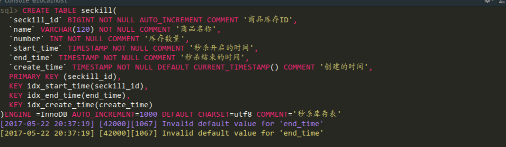
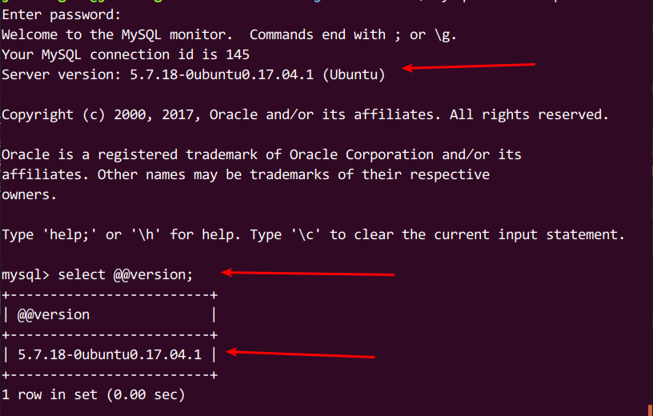

### (一)Java高并发秒杀APi之业务分析与DAO层代码编写
#### 构建项目的基本骨架
 * 首先我们要搭建出一个符合Maven约定的目录来,这里大致有两种方式,第一种:
1. 第一种使用命令行手动构建一个maven结构的目录,当然我基本不会这样构建
```
mvn archetype:generate -DgroupId=org.seckill -DartifactId=seckill -Dpackage=org.seckill -Dversion=1.0-SNAPSHOT -DarchetypeArtifactId=maven-archetype-webapp
```  
这里要注意的是使用`archetype:generate`进行创建,在Maven老版本中是使用`archetype:create`,现在这种方法已经被弃用了,所以使用命令行创建的话注意了,稍微解释下这段语句的意思,就是构建一个一个`maven-archetype-webapp`骨架的Webapp项目,然后`groupId`为`org.seckill `,`artifactId`为`seckill`,这里是Maven相关知识,可以按照自己的情况进行修改  

2.第二种直接在IDE中进行创建,这里以IDEA为例
  + 点击左上角`File>New>Project>Maven`
  + 然后在里面勾选`Create from archetype`,然后再往下拉找到`org.apache.cocoon:cocoon-22-archetype-webapp`,选中它,注意要先勾选那个选项,否则选择不了,然后点击`Next`继续  
      
  +然后就填写你的Maven的那几个重要的坐标了,自己看着填吧  
    
  +再就配置你的Maven的相关信息,默认应该是配置好的  
    
  +之后就是点`Finsh`,到此不出意外的话就应该创建成功了    
  
#### 构建pom文件
  
  项目基本的骨架我们就创建出来了,接下来我们要添加一些基本的JAR包的依赖,也就是在[pom.xml](/pom.xml)中添加各种开源组件的三坐标了    
#### 建立数据库
在根目录下有一个[sql](/src/main/sql)文件夹里面存放着本项目的数据库脚本,如果你不想自己手写的话就直接导入到你的数据库里面去吧,不过还是建议自己手写一遍加深印象

+ 在建立数据库的,如果按照我这里的数据库脚本建立的话应该是没问题的,但是我按照视频里面的数据库脚本建表的话发生了一个错误  
  
 这个报错看起来比较的诡异,我仔细检查`sql`也没有错误,它总提示我`end_time`要有一个默认的值,可我记得我以前就不会这样,然后视频里面也没有执行错误,然后我感觉可能时`MySQL`版本的差异,我查看了下我数据库版本,在登录`Mysql`控制台后输入指令,在控制台的我暂时知道的有两种方式:
 ```sql
select version();  
select @@version;
```
我的输出结果如下:

其实登录进控制台就已经可以看到版本了,我的Mysql是`5.7`的,以前我用的时`5.6`的,然后去`Google`上搜索了下,找到了几个答案,参考链接：  
 - [Invalid default value for 'create_date' timestamp field](https://stackoverflow.com/questions/9192027/invalid-default-value-for-create-date-timestamp-field)  
 - [mysql官方的解释](https://dev.mysql.com/doc/refman/5.7/en/sql-mode.html#sqlmode_no_zero_date)  
 - [MySQL Community 5.7 - Invalid default value (datetime field type)
](https://stackoverflow.com/questions/34570611/mysql-community-5-7-invalid-default-value-datetime-field-type)  
总结出来一句话就是:
> mysql 5.7中,默认使用的是严格模式,这里的日期必须要有时间,所以一定要给出默认值,要么就修改数据库设置  

然后网友评论里总结出来的几种解决办法,未经测试！：  
 + 下次有问题一定要先看一下评论！！！create不了的同学,可以这样写：
 ```sql
    `start_time` TIMESTAMP NOT NULL DEFAULT CURRENT_TIMESTAMP COMMENT '秒杀开始时间',
    `end_time` TIMESTAMP NOT NULL DEFAULT CURRENT_TIMESTAMP COMMENT '秒杀结束时间',
    `create_time` TIMESTAMP NOT NULL DEFAULT CURRENT_TIMESTAMP COMMENT '创建时间',
 ```
    
   + 关于timestamp的问题,需要先运行 set explicit_defaults_for_timestamp = 1,否则会报invalid default value错误
   + 还需要注意的是SQL版本的问题会导致视频中seckill表创建会出错。只要将create_time放在start_time和end_time之前是方便的解决方法。  

 对比下我修改过后的跟视频里面的`sql`片段:
   
 我们可以看到在这三个字段有一个小差别,那就是给`start_time`,`end_time`,`create_time`三个字段都添加一个默认值,然后执行数据库语句就没问题了
 
---
####  这里我们需要修改下`web.xml`中的servlet版本为`3.0`
打开`WEB-INF`下的`web.xml`,修改为以下代码:
```xml
<web-app xmlns="http://java.sun.com/xml/ns/javaee"
         xmlns:xsi="http://www.w3.org/2001/XMLSchema-instance"
         xsi:schemaLocation="http://java.sun.com/xml/ns/javaee
                      http://java.sun.com/xml/ns/javaee/web-app_3_0.xsd"
         version="3.0" metadata-complete="true">
    <!--用maven创建的web-app需要修改servlet的版本为3.0-->
```
修改的原因有以下几点:  
   * 高版本的Servlet支持更多的特性,更方便我们的Coding,特别是支持注解这一特性
   * 在`Servlet2.3`中新加入了`Listener`接口的实现,,我们可以使用`Listener`引入`Spring`的`ContextLoaderListener`  

举个栗子:  
  + 在`Servlet2.3`以前我们这样配置`ContextLoaderListener`:
```xml
<servlet>
 <servlet-name>context</servlet-name>
 <servlet-class>org.springframework.context.ContextLoaderServlet</servlet-class>
 <load-on-startup>1</load-on-startup>
</servlet>
```
 + 在`Servlet2.3`以后可以使用`Listener`配置,也就是我们项目中使用的方法
 ````xml
<listener>
 <listener-class>org.springframework.context.ContextLoaderListener</listener-class>
</listener>
````
两种方法的效果都是一样的,主要不要同时使用,否则会报错的  

#### 建立实体类
 - 首先建立[SuccessKilled](/src/main/java/org/seckill/entity/SuccessKilled.java)秒杀状态表
 - 再建立[Seckill](/src/main/java/org/seckill/entity/Seckill.java)秒杀商品信息
#### 对实体类创建对应的`mapper`接口,也就是`dao`接口类
 - 首先创建[SeckillDao](/src/main/java/org/seckill/dao/SeckillDao.java),在我这里位于`org.seckill.dao`包下
 - 再创建[SuccessKilledDao](/src/main/java/org/seckill/dao/SuccessKilledDao.java)
#### 接下来书写`xml`配置文件
##### 建立对应的`mapper.xml`  

首先在`src/main/resources`下建立`mapper`这个文件夹  
- 首先建立[SeckillDao.xml](/src/main/resources/mapper/SeckillDao.xml)
- 建立[SuccessKilledDao.xml](/src/main/resources/mapper/SuccessKilledDao.xml)
- 在`src/main/resources`根目录下建立`Mybatis`的配置文件[mybatis-config.xml](/src/main/resources/mybatis-config.xml)
- 然后建立连接数据库的配置文件[jdbc.properties](/src/main/resources/jdbc.properties),这里的属性要根据自己的需要去进行修改,切勿直接复制使用  
- 建立`Spring`的`dao`的配置文件,在`src/main/resources/spring`包下创建[spring-dao.xml](/src/main/resources/spring/spring-dao.xml)

- 基础的部分我们搭建完成了,然后要开始测试了
 在`IDEA`里面有一个快速建立测试的快捷键`Ctrl+Shift+T`,在某个要测试的类里面按下这个快捷键就会出现`Create new Test`,然后选择你要测试的方法跟测试的工具就可以了,这里我们使用Junit作为测试
  + 建立[SeckillDaoTest.java](/src/test/java/org/seckill/dao/SeckillDaoTest.java)文件.
测试中可能会出现`Mybatis`参数绑定失败的错误,在`mapper`接口中的方法里面添加`@Param`的注解,显示的告诉mybatis参数的名称是什么,例如
```java
List<Seckill> queryAll(@Param("offset") int offset, @Param("limit") int limit);
```  

###下一篇    [(二)Java高并发秒杀API之Service层](../note/note2.md)

---
- [(三)Java高并发秒杀API之web层](../note/note3.md)
- [(四)Java高并发秒杀API之高并发优化](../note/note4.md)  

---

如果项目流程总结中有什么问题欢迎发`Issue`给我,或者您也可以直接联系我`ZR_sxlx@163.com`,感谢您的阅读