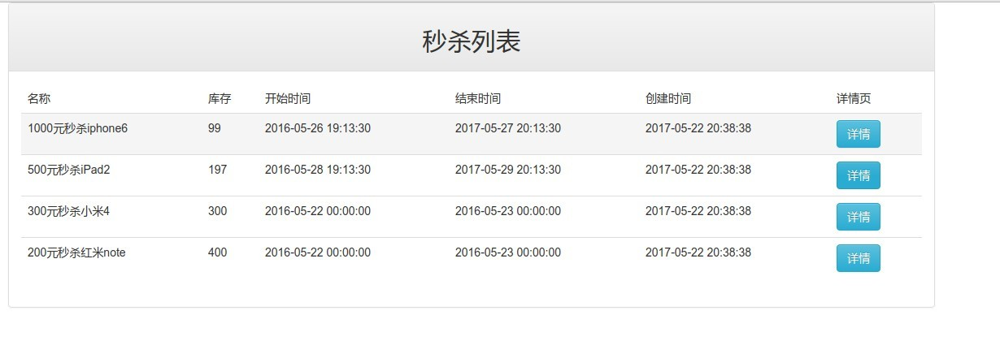

### (三)Java高并发秒杀系统API之Web层开发

#### 既然是Web层的会肯定要先引入SpringMvc了

+ 修改[web.xml](/src/main/webapp/WEB-INF/web.xml),引入`SpringMvc`的`DispatcherServlet`：
```xml
<web-app xmlns="http://java.sun.com/xml/ns/javaee"
         xmlns:xsi="http://www.w3.org/2001/XMLSchema-instance"
         xsi:schemaLocation="http://java.sun.com/xml/ns/javaee
                      http://java.sun.com/xml/ns/javaee/web-app_3_0.xsd"
         version="3.0"
         metadata-complete="true">
    <!--用maven创建的web-app需要修改servlet的版本为3.0-->

    <servlet>
        <servlet-name>seckill-dispatchServlet</servlet-name>
        <servlet-class>org.springframework.web.servlet.DispatcherServlet</servlet-class>
        <!--配置springmvc的配置文件-->
        <init-param>
            <param-name>contextConfigLocation</param-name>
            <param-value>classpath:spring/spring-*.xml</param-value>
        </init-param>
        <load-on-startup>
            1
        </load-on-startup>
    </servlet>
    <servlet-mapping>
        <servlet-name>seckill-dispatchServlet</servlet-name>
        <!--直接拦截所有请求,不再采用spring2.0的/*或者*.do方式-->
        <url-pattern>/</url-pattern>
    </servlet-mapping>
</web-app>
```
在这里的话如果你不配置这一段代码的：
```xml
<!--配置springmvc的配置文件-->
        <init-param>
            <param-name>contextConfigLocation</param-name>
            <param-value>classpath:spring/spring-*.xml</param-value>
        </init-param>
```
SpringMvc默认就会默认去`WEB-INF`下查找默认规范的配置文件,像我这里配置的`servlet-name`是`seckill-dispatchServlet`的话,则默认会寻找`WEB-INF`一个名为`seckill-dispatchServlet-Servlet.xml`的配置文件

#### 接下来编写Controller
首先在`org.seckill`下建立包名为`web`的包,然后在里面新建一个类[SeckillController.java](/src/main/java/org/seckill/web/SeckillController.java)：
#### 建立一个全局处理ajax请求返回结果的类
[SeckillResult](/src/main/java/org/seckill/dto/SeckillResult.java)

#### 页面的编写
因为项目的前端页面都是由`Bootstrap`开发的,所以我们要先去下载`Bootstrap`或者是使用在线的CDN.  
 -[Bootstrap中文官网](http://www.bootcss.com/)  
 -[Bootstrap中文文档](http://v3.bootcss.com/)
 使用在线CDN引入的方法:
 ```html
<!-- 最新版本的 Bootstrap 核心 CSS 文件 -->
<link rel="stylesheet" href="https://cdn.bootcss.com/bootstrap/3.3.7/css/bootstrap.min.css" integrity="sha384-BVYiiSIFeK1dGmJRAkycuHAHRg32OmUcww7on3RYdg4Va+PmSTsz/K68vbdEjh4u" crossorigin="anonymous">

<!-- 可选的 Bootstrap 主题文件（一般不用引入） -->
<link rel="stylesheet" href="https://cdn.bootcss.com/bootstrap/3.3.7/css/bootstrap-theme.min.css" integrity="sha384-rHyoN1iRsVXV4nD0JutlnGaslCJuC7uwjduW9SVrLvRYooPp2bWYgmgJQIXwl/Sp" crossorigin="anonymous">

<!-- 最新的 Bootstrap 核心 JavaScript 文件 -->
<script src="https://cdn.bootcss.com/bootstrap/3.3.7/js/bootstrap.min.js" integrity="sha384-Tc5IQib027qvyjSMfHjOMaLkfuWVxZxUPnCJA7l2mCWNIpG9mGCD8wGNIcPD7Txa" crossorigin="anonymous"></script>

```
文档里面写的很详细,也可以使用离线版本的,方便我们本地调试,避免出现什么别的因素干扰我们:
  - 首先下载`jQuery`,因为`Bootstrap`就是依赖`jQuery`的
  - 然后下载`Bootstrap`
  - 然后下载一个倒计时插件`jquery.countdown.min.js`
  -再下载一个操作`Cookie`插件`jquery.cookie.min.js`
  如图放置:  
  
  
  - 首先编写一个公共的头部`jsp`文件,位于`WEB-INF`下`common`中的`head.jsp`
  ````jsp
<meta name="viewport" content="width=device-width, initial-scale=1.0">
<meta charset="utf-8">
<link rel="stylesheet" href="${pageContext.request.contextPath}/resources/plugins/bootstrap-3.3.0/css/bootstrap.min.css" type="text/css">
<link rel="stylesheet" href="${pageContext.request.contextPath}/resources/plugins/bootstrap-3.3.0/css/bootstrap-theme.min.css" type="text/css">
  ````   
  - 然后编写一个公共的`jstl`标签库文件,位于`WEB-INF`下`common`中的`tag.jsp`
  ```jsp
<%@taglib prefix="c" uri="http://java.sun.com/jsp/jstl/core" %>
<%@ taglib prefix="fmt" uri="http://java.sun.com/jsp/jstl/fmt" %>
<%@ taglib prefix="fn" uri="http://java.sun.com/jsp/jstl/functions" %>
```  
 - 编写 [list.jsp](/src/main/webapp/WEB-INF/jsp/list.jsp)

 - 编写列表页面,位于`WEB-INF`下的[detail.jsp](/src/main/webapp/WEB-INF/jsp/detail.jsp)秒杀详情页面
  然后把项目运行一下我们可能又会碰到一个错误就是`jstl`中的`fmt`标签格式化时间只能格式化`java.Util.Date`类型的日期跟时间,而在我们这里我么使用了`java8`的`LocalDateTIme`,所以解析时间会出异常,这时我们应该想到自己去实现`jstl`标签来自定义解析这个时间日期
  自定义标签步骤如下:  
  - 在` /WEB-INF `创建目录 `tags`
  - 然后创建一个文件` localDateTime.tag` 在`tags`目录下
     + `localData.tag`用来格式化日期
      + `localDataTime.tag`用来格式化日期跟时间的组合,也就是数据库中的`Timestamp`类型
  -然后在`localDataTime.tag`中写自己自定义的格式化流程
  ```xml
<%--格式化java8的LocalDatime,解决jstl不支持java8时间的问题--%>
<%@ tag body-content="empty" pageEncoding="UTF-8" trimDirectiveWhitespaces="true" %>
<%@ taglib prefix="fmt" uri="http://java.sun.com/jsp/jstl/fmt" %>
<%@ taglib prefix="c" uri="http://java.sun.com/jsp/jstl/core" %>
<%@ taglib prefix="fn" uri="http://java.sun.com/jsp/jstl/functions" %>
<%--        这里是定义页面使用标签中的属性设置,<tags:localDataTime dateTime="${sk.createTIme}"/>     --%>
<%@ attribute name="dateTime" required="true" type="java.time.LocalDateTime" %>
<%@ attribute name="pattern" required="false" type="java.lang.String" %>
<%--首选判断日期时间转换规则是否存在,不存在给出默认的规则--%>
<c:if test="${empty pattern}">
    <c:set var="pattern" value="yyyy-MM-dd HH:mm:ss"/>
</c:if>
<c:set var="datetime" value="${dateTime}"/>                        <%-- 获取jsp页面传入的【 日期时间 】,格式为【 2017-5-26T13:59:12  】 --%>
<c:set var="time" value="${fn:substringAfter(datetime, 'T')}"/>     <%--   获取页面传过来的【时间T】后面的 【  时:分:秒 】的值  --%>
<c:set var="timeLength" value="${fn:length(time)}"/>                <%--  获取页面传来的 【 时:分:秒 的长度  】 --%>
<c:set var="generalLength" value="${fn:length('123456')}"/>         <%--  这里定义了一个【Integer】类型的值,值为字符串 【123456 】的长度   --%>
<c:set var="cloneZero" value=":00"/>                                 <%--   这里设置一个值为【String】的字符串,     --%>
<%-- 当  时:分:秒 不足6位的时候就说明缺少秒,我们给它自动补充 :00    --%>
<c:if test="${timeLength lt generalLength}">
    <c:set var="datetimeCloneZero"
           value="${datetime}${cloneZero}"/>          <%--  拼接页面传过来的  【 时：分 】  ,补充一个【秒数】,EL中 + 为相加,非拼接字符串   --%>
    <c:set var="cleandDateTime"
           value="${fn:replace(datetimeCloneZero,'T',' ')}"/>      <%--  把java8日期时间中的【 T 】给去掉,换成一个空的字符串    --%>
</c:if>
<%--  当页面传过来的时间大于6位时说明时间时完整的,不进行自动填充【 :00 】,直接把日期时间中的 【 T 】 替换为空字符串 --%>
<c:if test="${timeLength gt generalLength}">
    <c:set var="cleandDateTime" value="${fn:replace(datetime,'T',' ')}"/>
</c:if>
<%--   解析时间, type="BOTH"为同时解析日期跟时间    --%>
<fmt:parseDate value="${cleandDateTime}" var="parsedDateTime" pattern="${pattern}" type="BOTH"/>
<fmt:formatDate value="${parsedDateTime}" pattern="${pattern}" type="BOTH"/>
```
- `localData.tag`的内容就比较简单了
```xml
<%@ tag body-content="empty" pageEncoding="UTF-8" trimDirectiveWhitespaces="true" %>
<%@ taglib prefix="fmt" uri="http://java.sun.com/jsp/jstl/fmt" %>
<%@ taglib prefix="c" uri="http://java.sun.com/jsp/jstl/core" %>

<%@ attribute name="date" required="true" type="java.time.LocalDate" %>
<%@ attribute name="pattern" required="false" type="java.lang.String" %>

<c:if test="${empty pattern}">
    <c:set var="pattern" value="MM/dd/yyyy"/>
</c:if>
<fmt:parseDate value="${date}" var="parsedDate" type="date"/>
<fmt:formatDate value="${parsedDate}" type="date" pattern="${pattern}"/>
```

 - 然后我们去页面导入需要的标签,然后去使用,修改`list.jsp`文件
 ```jsp
<%@page contentType="text/html; charset=UTF-8" language="java" %>
<%@include file="common/tag.jsp" %>  
<%@taglib prefix="tags" tagdir="/WEB-INF/tags" %>
<!DOCTYPE html>
<html lang="zh-CN">
<head>
    <title>秒杀列表</title>
    <%@include file="common/head.jsp" %>
</head>
<body>

<div class="container">
    <div class="panel panel-default">
        <div class="panel-heading text-center">
            <h2>秒杀列表</h2>
        </div>

        <div class="panel-body">
            <table class="table table-hover">
                <thead>
                <tr>
                    <td>名称</td>
                    <td>库存</td>
                    <td>开始时间</td>
                    <td>结束时间</td>
                    <td>创建时间</td>
                    <td>详情页</td>
                </tr>
                </thead>
                <tbody>
                <c:forEach items="${list}" var="sk">
                    <tr>
                        <td>${sk.name}</td>
                        <td>${sk.number}</td>
                        <td><tags:localDataTime dateTime="${sk.startTime}"/></td>
                        <td><tags:localDataTime dateTime="${sk.endTime}"/></td>
                        <td><tags:localDataTime dateTime="${sk.createTIme}"/></td>
                        <td><a class="btn btn-info" href="/seckill/${sk.seckillId}/detail" target="_blank">详情</a></td>
                    </tr>
                </c:forEach>
                </tbody>
            </table>
        </div>
    </div>
</div>
</body>
<script src="${pageContext.request.contextPath}/resources/plugins/jquery.js"></script>
<script src="${pageContext.request.contextPath}/resources/plugins/bootstrap-3.3.0/js/bootstrap.min.js"></script>
</html>
```
 在这里我们修改了几个地方:
 ```jsp
 <%@taglib prefix="tags" tagdir="/WEB-INF/tags" %> 
```
 ```jsp
 <td><tags:localDataTime dateTime="${sk.startTime}"/></td>
 <td><tags:localDataTime dateTime="${sk.endTime}"/></td>
 <td><tags:localDataTime dateTime="${sk.createTIme}"/></td>
```
然后我们的格式就应该可以正常被格式化出来了
 -  建立一个模块化的[seckill.js](/src/main/webapp/resources/script/seckill.js)文件,位于`Webapp`下 `resources`下`script`文件夹下
自定义jstl标签参考资料  
[stackoverflow上的资料1](https://stackoverflow.com/questions/35606551/jstl-localdatetime-format)  
[stackoverflow上的资料2](https://stackoverflow.com/questions/30230517/taglib-to-display-java-time-localdate-formatted)  
编写完了就部署运行吧,不出意外的话就是这个样子的:  

 
 
### 上一篇  [(二)Java高并发秒杀API之Service层](../note/note2.md) 

 ### 下一篇     [(四)Java高并发秒杀API之高并发优化](../note/note4.md) 
   
 ---
 - [(一)Java高并发秒杀API之Service层](../note/note2.md)  
 
 
 --- 
 
 如果项目流程总结中有什么问题欢迎发`Issue`给我,或者您也可以直接联系我`ZR_sxlx@163.com`,感谢您的阅读